# 2nd Time Around

your stuff deserves a second chance. the UC-only marketplace for buying,
selling, donating, and finding lost things.

**live:** https://2ndtime-around.vercel.app · built by Team 4 — IT2021,
University of Cincinnati

no randoms from across town. no sketchy meetups. no "is this still
available?" into the void. every account is a UC student, every meetup spot
is on campus, and every sale keeps something out of a dumpster.

now on **v3** — a full design-elevation + usability pass on top of v2's
feature set. what changed is [below](#v3--design-elevation); every screenshot
in this README is v3.

## the stack

- **Next.js 15** (App Router) + TypeScript, strict mode — no `any`, no mercy
- **Tailwind 4** — one accent color (UC Red), warm neutrals, zero clutter
- **Prisma + Postgres** (SQLite locally, zero config)
- **NextAuth** — magic links, `@uc.edu` only
- **Zod** — the server trusts nobody

## design tokens

everything visual derives from one `@theme` block in `src/app/globals.css`
(Tailwind 4). if you're adding UI, use these — never a raw hex or an ad-hoc
size:

| token | value | use |
| --- | --- | --- |
| `paper` | `#FAFAF9` | app background |
| `surface` | `#FFFFFF` | cards, sheets, inputs |
| `ink` | `#1C1917` | primary text |
| `faint` | `#57534E` | secondary text (AA on paper/surface) |
| `accent` | `#E00122` | UC Red — the ONLY accent: primary buttons, active states, badges |
| `line` | `#E7E5E4` | hairline borders (the default "shadow") |
| `line-strong` | `#D6D3D1` | stronger hairline: muted chart fills, map massing |
| `success` | `#16A34A` | confirmations only |

rules of the house:

- **type scale** — `text-xs` 12 / `text-sm` 14 / `text-base` 16 / `text-lg` 18 /
  `text-xl` 20 / `text-2xl` 24, display sizes (`4xl`–`6xl`) reserved for the
  landing hero + stat numerals. aim for ≤3 sizes per screen; nothing below 12px.
- **radius** — cards `rounded-xl`, inputs/buttons `rounded-lg`, pills/badges
  `rounded-full`. nested elements may step down one (e.g. `rounded-md` inside a
  padded `rounded-lg` segmented control) so corners stay optically concentric.
- **depth** — hairline borders, not shadows. the single exception is
  `shadow-float` on truly floating surfaces (menus, sheets, toasts).
- **width** — one page container, `max-w-page` (1100px), shared by header,
  main, and footer so edges always align. `px-4` gutters everywhere.
- **rhythm** — Tailwind spacing scale; section gaps use 4/5/6 steps
  consistently (`mt-5` between blocks, `p-4`/`p-5` card padding).
- **status colors** — every listing status badge goes through
  `src/components/StatusBadge.tsx`; charts/maps that can't read Tailwind
  classes use `var(--color-…)` or, as a last resort, `src/lib/theme.ts`.
- **motion** — 150–250ms, one expo-out ease, all neutralized under
  `prefers-reduced-motion`.

## run it

```bash
npm install      # deps + prisma client
npm run db:push  # local SQLite db, no setup
npm run db:seed  # 7 users, 46 listings, drama included
npm run dev      # localhost:3000
```

that's it. no `.env` needed locally — SQLite happens automatically.

## signing in (demo mode)

right now the app is invite-only on purpose. `/signin` is a persona picker —
two accounts, one shared password (the `DEMO_PASSWORD` env var):

- **Alex Demo** — pre-loaded with unread messages, a meetup proposal to
  accept, a lost & found claim to judge, and a rating waiting to happen
- **Professor** — clean account. explore, post, break things

picking a persona creates a real session (same table NextAuth uses), so
sign-out and auth guards work exactly like the real thing. the endpoint
only accepts the two listed emails — the password alone gets you nowhere
else. unset `DEMO_PASSWORD` and the whole side door disappears.

open sign-up isn't missing, it's parked: the full UC magic-link flow
(domain gate enforced server-side, links logged to console in dev) is
implemented and waiting on one env var + a UI toggle.

## env vars

| var | needed? | what |
| --- | --- | --- |
| `DATABASE_URL` | prod only | postgres url; local falls back to SQLite |
| `NEXTAUTH_SECRET` | prod only | `openssl rand -base64 32` |
| `NEXTAUTH_URL` | prod only | your deployed origin |
| `DEMO_PASSWORD` | for demo mode | gates the persona sign-in |
| `EMAIL_SERVER` / `EMAIL_FROM` | later | SMTP for real magic links + activity notifications |

> **Secrets live in env vars only — never in `public/`.** Anything under
> `public/` is served at the site root, so a secret there is a public secret.
> Set `DEMO_PASSWORD`, `NEXTAUTH_SECRET`, and `DATABASE_URL` in the shell or the
> Vercel project, not in any committed or served file. `/api/demo-login` is
> enabled only while `DEMO_PASSWORD` is set — unset it to turn persona sign-in
> off entirely (e.g. for a real-users launch).

## deploy

push to main → Vercel builds it. needs the env vars above, a postgres db
(`npm run db:push` once against it — the prisma provider flips to postgres
automatically), and a Vercel Blob store for photos. that's the whole
ceremony.

## screenshots

> demo walkthrough: [`docs/DEMO_SCRIPT.md`](docs/DEMO_SCRIPT.md) · system
> design: [`docs/SYSTEM_DESIGN.md`](docs/SYSTEM_DESIGN.md)

| Landing | Sign in (demo mode) |
| --- | --- |
|  | 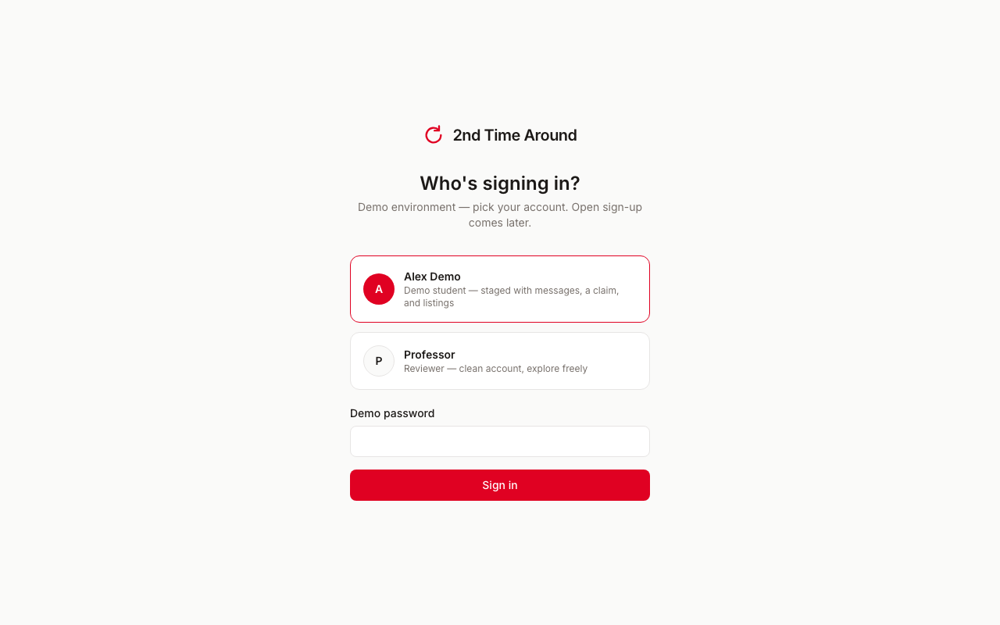 |

| Landing on mobile | |
| --- | --- |
| 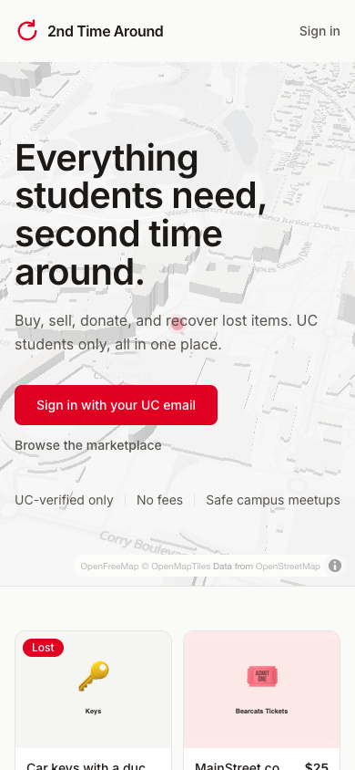 | |

| Browse (Marketplace) | Lost & Found |
| --- | --- |
|  |  |

| Listing detail | Mobile browse |
| --- | --- |
|  |  |

| Sell wizard | My items |
| --- | --- |
|  |  |

| Meetup proposal in chat | Lost & found claim |
| --- | --- |
|  |  |

| Campus impact | |
| --- | --- |
|  | |

| Moderator analytics — Funnel | Demand index, funnel & marketplace health |
| --- | --- |
| 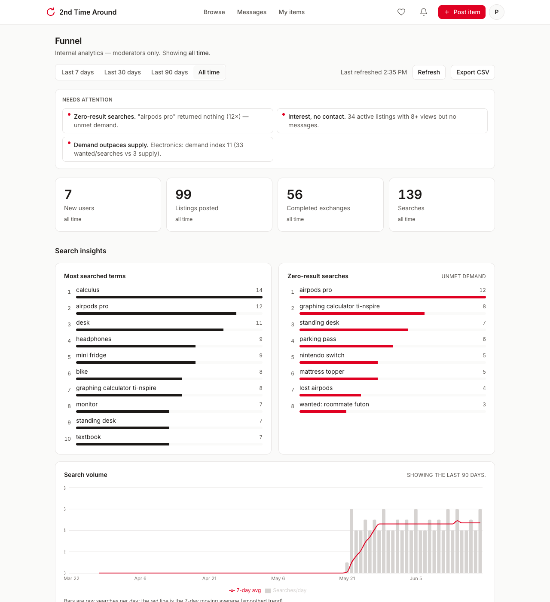 | 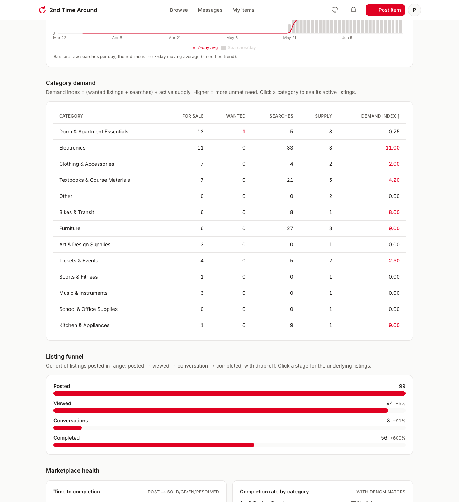 |

## v1 → v2: what changed

v2 keeps the same calm, one-accent look and adds eleven features across
discovery, engagement, trust & safety, and campus-native moments — without
adding a second accent color or a single spinner.

| area | v1 | v2 |
| --- | --- | --- |
| **discovery** | 3 tabs, category + price filters | **Wanted** tab (a 5th "looking for" listing type), condition filter, sort high→low, dismissible filter pills, live result count |
| **saved searches** | — | follow a search and get notified when a match is posted |
| **favorites** | — | one-tap heart on every card + watchlist, with price-drop and sold nudges |
| **notifications** | unread dot on Messages only | full notifications center (bell + email) for messages, claims, meetups, ratings, saved-search hits, price drops |
| **chat** | 5s polling | near-real-time (SSE) with optimistic send + **Seen**, add-to-calendar and share on accepted meetups |
| **trust & safety** | — | report & block (both-way), plus a moderator queue |
| **move-out mode** | — | bulk-list everything at once → one shareable move-out sale page |
| **impact** | campus totals | + personal panel and earned badges (Trusted Trader, Quick Replier, Good Samaritan, …) |
| **pricing** | type a number | smart suggestion from recent comparable listings while you post |

**Browse — before / after.** Note the new **Wanted** tab, condition filter,
result count, the favorite hearts on every card, and the heart + bell in the
header.

| v1 | v2 |
| --- | --- |
| 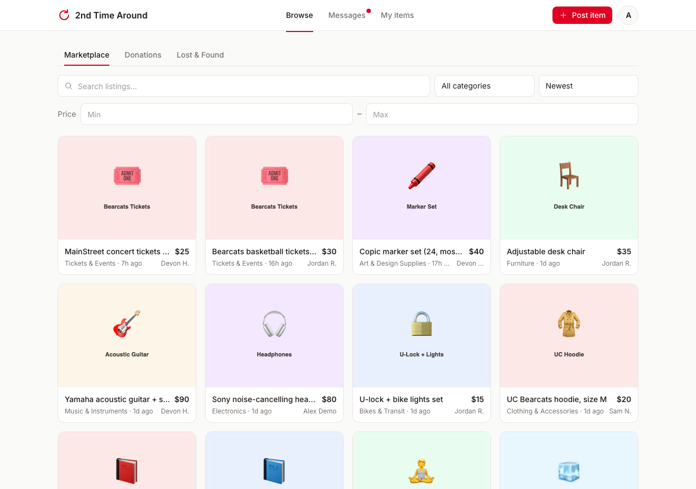 | 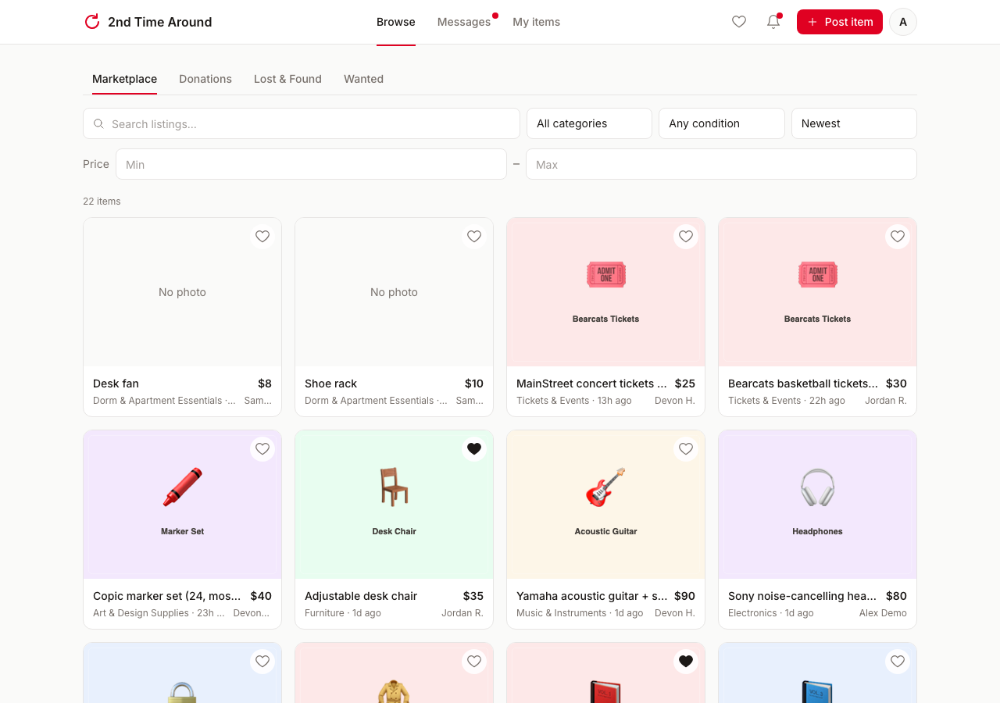 |

**Listing detail — before / after.** v2 adds a save (favorite) button, a
report/block overflow menu, and safety blurbs on the suggested meetup spots.

| v1 | v2 |
| --- | --- |
| 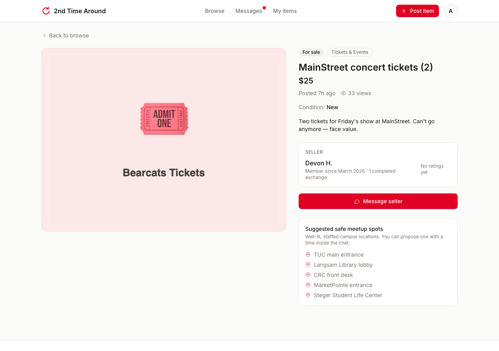 | 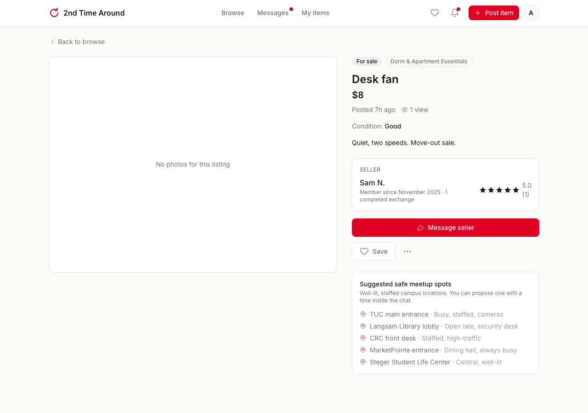 |

**New screens in v2.**

| Notifications | Saved (favorites + searches) |
| --- | --- |
| 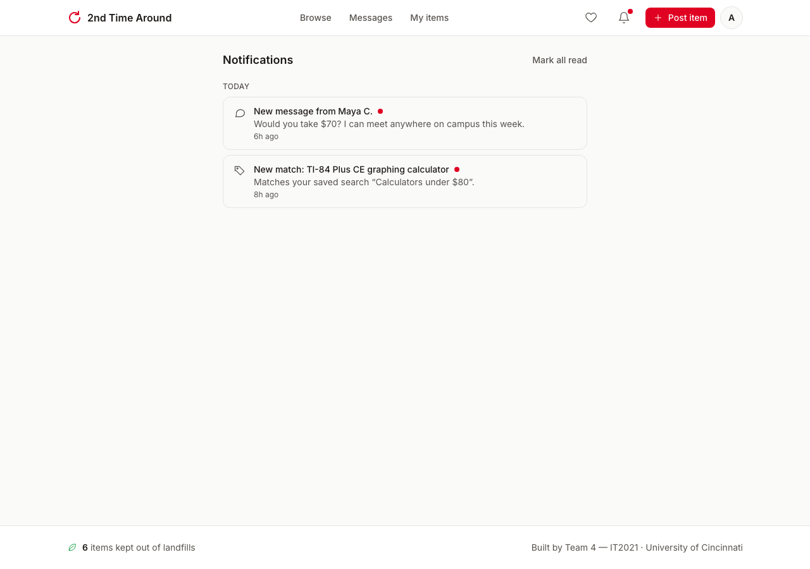 | 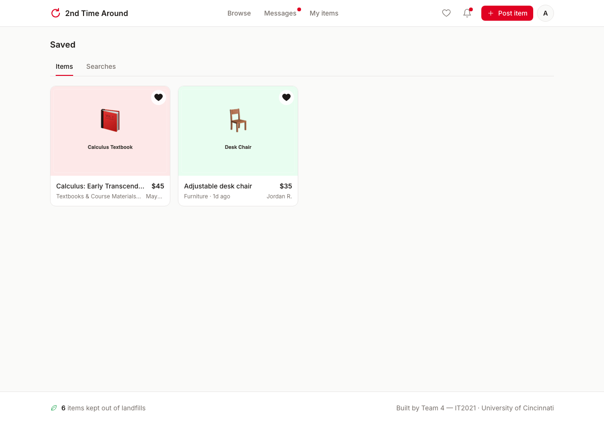 |

| Move-out sale (shareable) | Moderation queue |
| --- | --- |
| 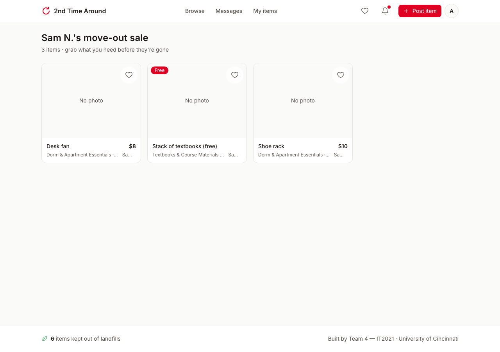 | 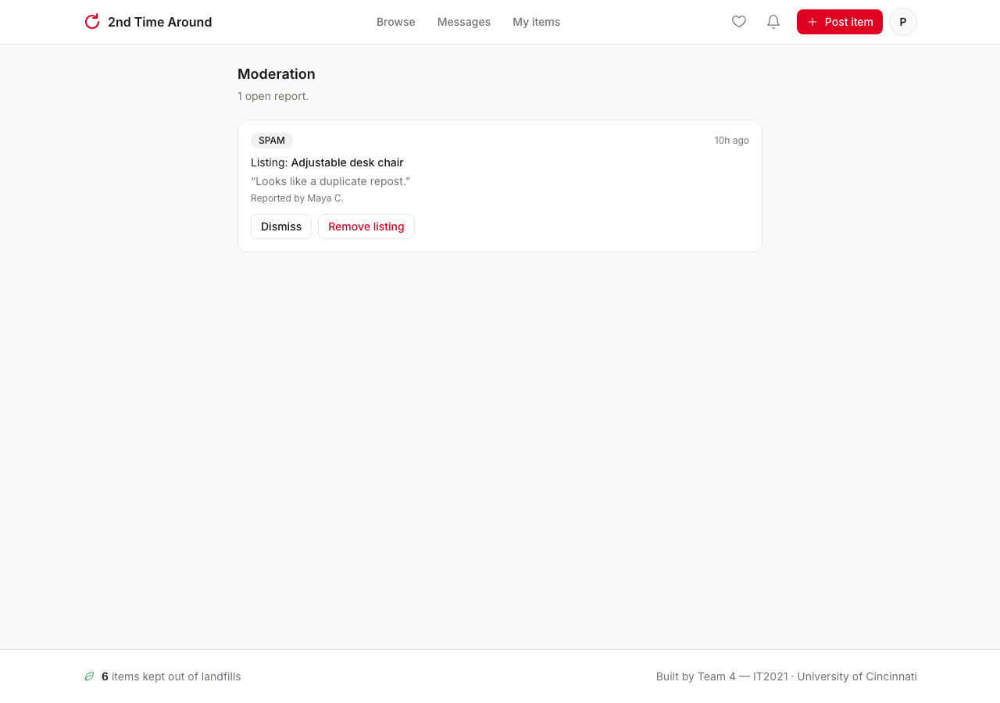 |

## v3 — design elevation

v3 isn't new features — it's the same product, made to feel like Apple shipped
it. Depth from light instead of lines, purposeful motion, a frosted material
header, and a warm optical serif (Fraunces) for display moments — all without a
second accent color or breaking a single accessibility rule.

| area | v2 | v3 |
| --- | --- | --- |
| **depth** | flat, 1px borders everywhere | soft layered elevation — cards lift, sheets float, header separates on scroll |
| **motion** | color transitions only | one expo-out ease, staggered entrance reveals, tactile press states (all off under `prefers-reduced-motion`) |
| **material** | opaque header | frosted backdrop-blur header, borderless at top |
| **type** | one sans (Inter) | + Fraunces display serif for the hero, page titles, and big stat numerals |
| **landing** | live listing preview | + a real **campus-impact band**: items kept out of Cincinnati landfills, dollars traded student-to-student, items given free |
| **accessibility** | baseline | a full heuristic-evaluation pass — ~20 fixes (44px targets, high-contrast focus ring, skip-to-content, roving-tabindex radios, undo on destructive actions…), written up in [`docs/HCI_UX_REPORT.md`](docs/HCI_UX_REPORT.md) |
| **correctness & scale** | — | race-free favorites/claims, real browse pagination, block-aware notifications, cached impact counts, SSE poll demoted to a true fallback |

The whole thing propagates from shared design tokens + primitives, so the
elevation lands on every screen, not just the landing.

## how it's laid out

```
src/
  app/
    page.tsx           landing (signed in? → /browse)
    signin/            persona picker
    (app)/             everything behind auth
      browse/          Marketplace · Donations · Lost & Found
      listing/[id]/    detail, edit, owner actions, "this is mine"
      sell/            4-step wizard, one question per screen
      messages/        threads, 5s polling, meetup proposals, claims
      my-items/        Active / Sold / Drafts
      profile/[id]/    ratings live here
      impact/          the landfill counter, explained
    api/               auth, uploads, message polling, demo login
  lib/
    actions/           server actions — every mutation validated + authorized
    ...                auth, zod schemas, db, uploads, constants
  components/          the design system (Button, Badge, Field, Stars…)
prisma/                schema + seed
```

every mutation goes: form → server action → zod → "do you even own this?" →
db. client-side validation is decoration; the server is the bouncer.

messaging is 5-second polling — no websockets, no regrets at this scale.
meetup proposals and ownership claims are just messages with a `kind` and
some json, rendered as cards you can tap accept/decline on.

## decisions worth knowing

- **13 categories**, built for campus life — Textbooks by college, Bikes &
  Transit, Music & Instruments (CCM), Art & Design Supplies (DAAP). full
  reasoning in the [design doc](docs/SYSTEM_DESIGN.md). subcategories stay
  search terms — deep menus on a phone are violence.
- **donations aren't a category, they're a tab** — free stuff gets equal
  billing, not a landfill page at the bottom.
- **the claim flow is the flex**: describe a detail only the owner would
  know → finder approves → contacts exchanged, item resolved. the physical
  lost & found office is closed at 11pm. we're not.
- **impact counting is honest** — completed sales + donations count as
  reuse; returned lost items are tracked separately because giving
  something back isn't recycling.
- **DRAFT status** exists beyond the original spec so half-written posts
  have somewhere to live.
- **`prepare-db.mjs`** flips the prisma provider between SQLite and
  postgres based on `DATABASE_URL`, because prisma won't read it from env
  and we refuse to maintain two schemas.
- view counts skip the owner. inflating your own numbers is cringe.
