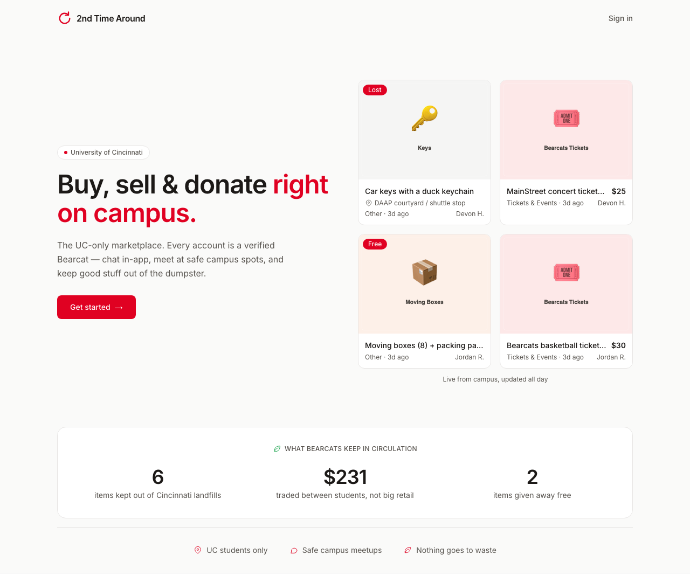
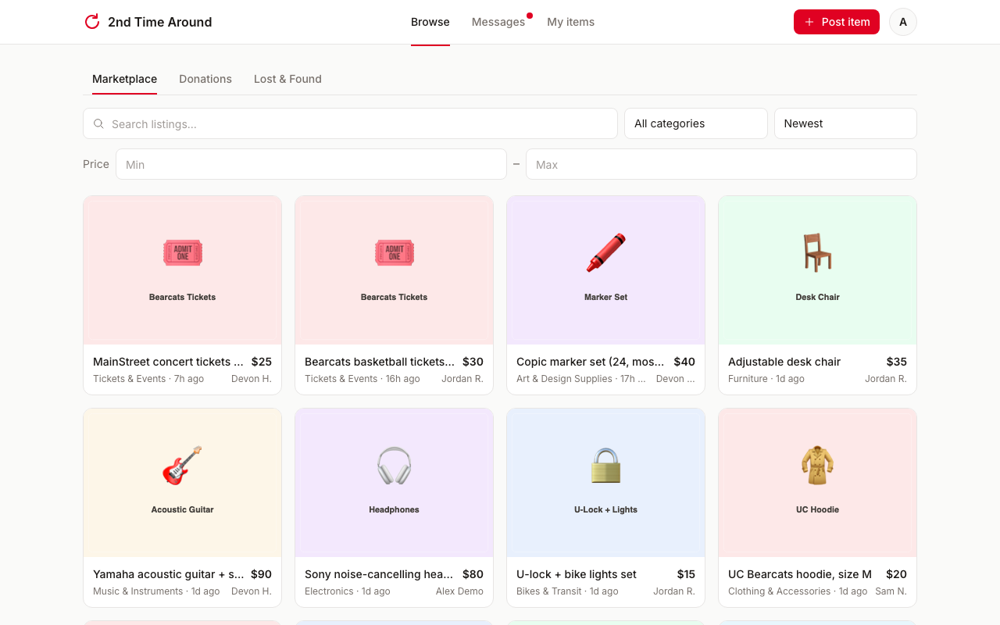
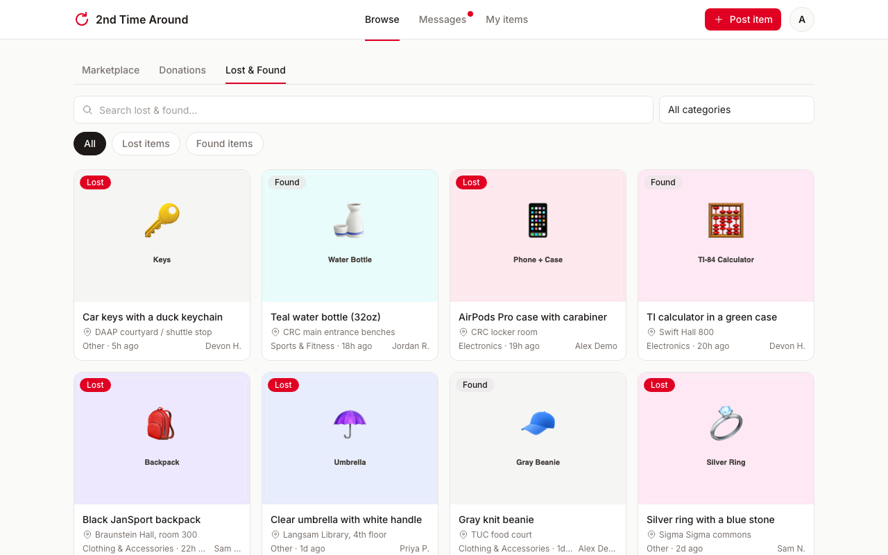
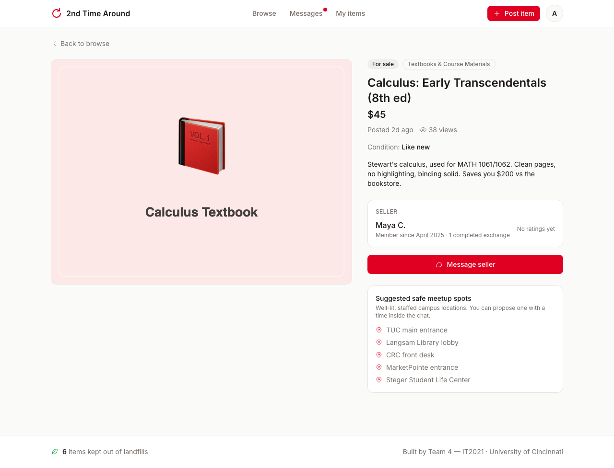
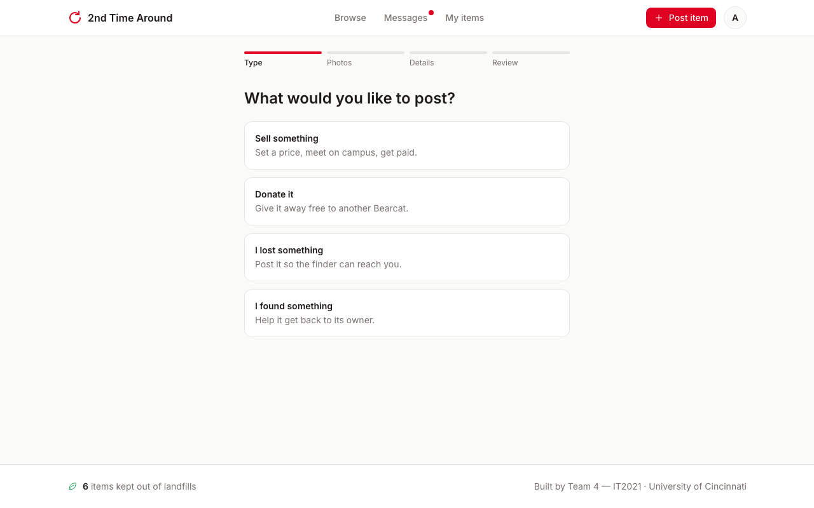
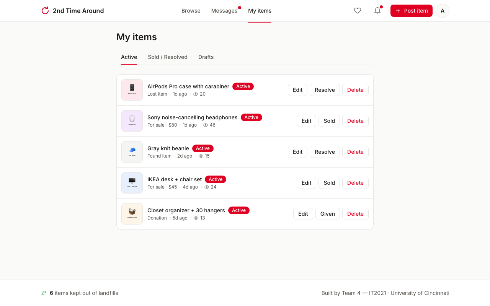
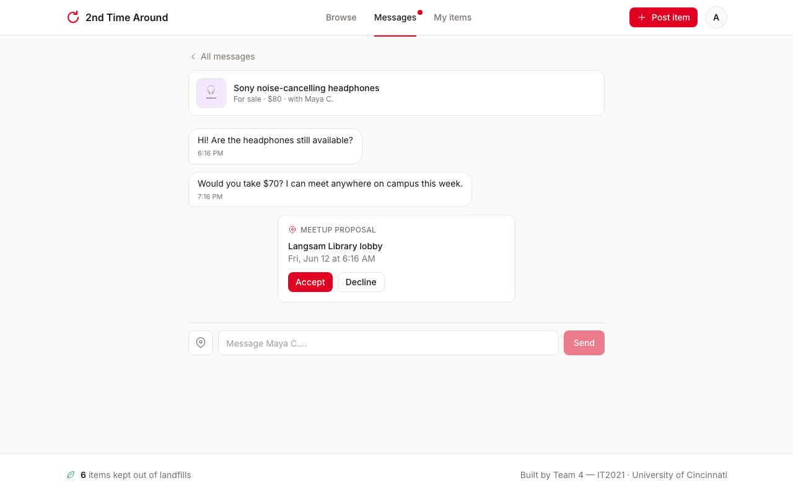
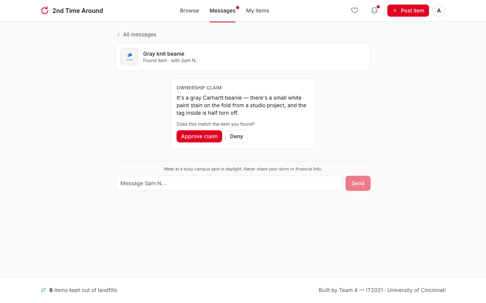
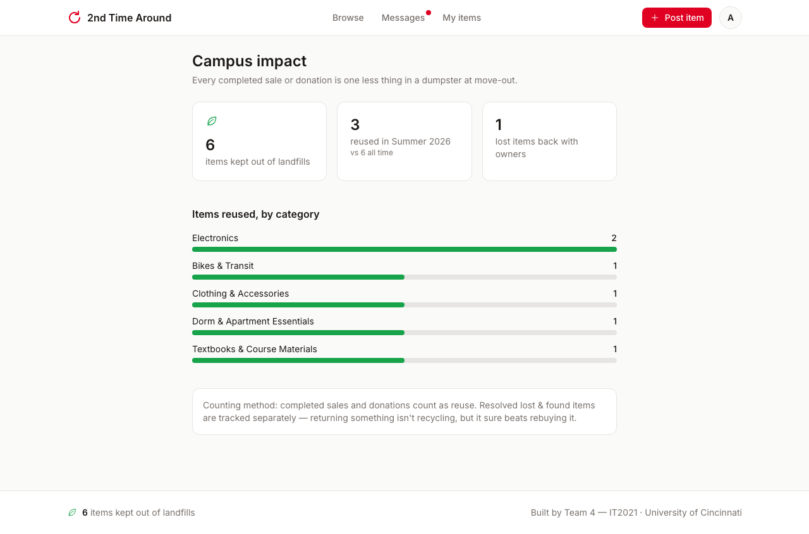
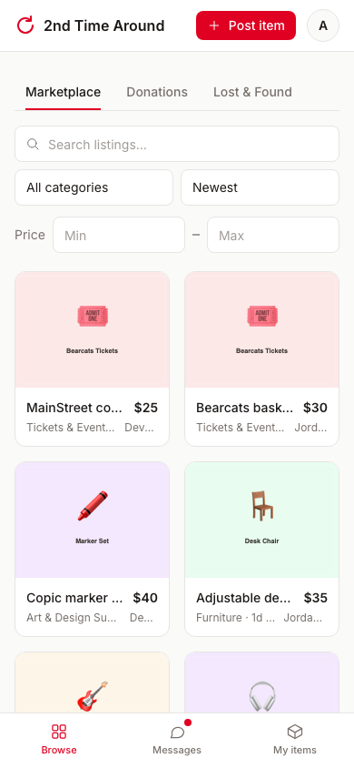

# 2nd Time Around

The UC-only marketplace for buying, selling, donating, and finding lost items.

Built by **Team 4 — IT2021**, University of Cincinnati (HCI course project).

Every user is a verified UC student. Listings, in-app messaging, safe
on-campus meetup suggestions, a digital lost & found with an ownership-claim
flow, and a sustainability counter all live in one place — replacing the
fragmented mix of Facebook Marketplace, GroupMe chats, and the physical
lost & found office.

## Tech stack

- **Next.js 15 (App Router)** + TypeScript (strict)
- **Tailwind CSS 4** with a disciplined token set (one accent: UC Red `#E00122`)
- **Prisma ORM** — PostgreSQL in production, SQLite fallback for local dev
- **NextAuth.js** email magic links, restricted to `@uc.edu` / `@mail.uc.edu`
- **Zod** validation on every mutation, **React Hook Form** for forms

## Getting started

```bash
npm install            # also generates the Prisma client (postinstall)
npm run db:push        # creates the local SQLite database (prisma/dev.db)
npm run db:seed        # 5 demo users, 26 listings, conversations, ratings
npm run dev            # http://localhost:3000
```

No `.env` is required for local dev — a SQLite `DATABASE_URL` is written
automatically. To customize, copy `.env.example` to `.env` and set
`NEXTAUTH_SECRET` (any random string) for stable sessions across restarts.

### Showcase sign-in (demo account)

For demos and grading there's a password sign-in that skips email entirely:
open **`/demo`** (also linked from the sign-in page), enter the demo
password, and you're in as **Alex Demo** — an account staged with active
listings, a draft, unread messages, a meetup proposal to accept, a pending
lost & found claim to approve, and an open rating prompt.

It's enabled only when the `DEMO_PASSWORD` env var is set (it creates a
normal database session, so sign-out and auth guards behave exactly like a
magic-link session). Unset the variable to turn it off.

### Signing in locally

No email server is configured in dev, so **the magic link is printed to the
terminal running `npm run dev`**. Enter any `@uc.edu` / `@mail.uc.edu`
address on the sign-in page (the seeded demo users work great, e.g.
`claybornm@mail.uc.edu`), then click the link from the terminal.
Non-UC domains are rejected both client-side and in the NextAuth `signIn`
callback — the inline error on the form is a courtesy; the server is the
gate.

### Environment variables

| Variable | Required | Notes |
| --- | --- | --- |
| `DATABASE_URL` | no (dev) / yes (prod) | Postgres URL in production; defaults to `file:./dev.db` locally |
| `NEXTAUTH_SECRET` | yes in prod | `openssl rand -base64 32` |
| `NEXTAUTH_URL` | yes in prod | The deployed origin |
| `EMAIL_SERVER` | no | SMTP URL; when unset, magic links log to the console |
| `EMAIL_FROM` | no | From address for real email |

### Deploying to Vercel

1. Create a Postgres database (Vercel Postgres / Neon / Supabase) and set
   `DATABASE_URL`, `NEXTAUTH_SECRET`, `NEXTAUTH_URL` (and `EMAIL_SERVER` /
   `EMAIL_FROM` for real magic-link emails).
2. `npm run db:push` once against the production database
   (`scripts/prepare-db.mjs` flips the Prisma provider to `postgresql`
   automatically when `DATABASE_URL` starts with `postgres`).
3. Push to the connected repo — the build runs `prisma generate && next build`.

Note: in production you'd swap the local `/public/uploads` photo storage for
S3/Vercel Blob — the app already talks to an `UploadService` interface
(`src/lib/uploads.ts`), so that's a one-class change.

## Screenshots

> Live at **https://2ndtime-around.vercel.app** · demo walkthrough in
> [`docs/DEMO_SCRIPT.md`](docs/DEMO_SCRIPT.md) · full architecture in
> [`docs/SYSTEM_DESIGN.md`](docs/SYSTEM_DESIGN.md)

| Landing | Browse (Marketplace) |
| --- | --- |
|  |  |

| Lost & Found | Listing detail |
| --- | --- |
|  |  |

| Sell wizard | My items |
| --- | --- |
|  |  |

| Meetup proposal in chat | Lost & found claim |
| --- | --- |
|  |  |

| Campus impact | Mobile browse |
| --- | --- |
|  |  |

## Architecture overview

```
src/
  app/
    page.tsx            landing (public; signed-in users → /browse)
    signin/             magic-link sign-in + "check your email"
    onboarding/         first-run display-name setup
    (app)/              auth-guarded shell (header, mobile tab bar, footer)
      browse/           tabs: Marketplace · Donations · Lost & Found
      listing/[id]/     detail, edit, owner actions, claim button
      sell/             4-step wizard (type → photos → details → review)
      messages/         conversation list + thread (5s polling)
      my-items/         Active / Sold & Resolved / Drafts
      profile/[id]/     public profile + ratings received
      impact/           sustainability stats (plain bars, no chart lib)
    api/
      auth/[...nextauth]/ NextAuth route
      upload/             photo upload (auth + type/size checks)
      conversations/[id]/messages/  poll target; marks incoming as read
  lib/
    actions/            server actions (listings, conversations, ratings)
    auth.ts validation.ts db.ts uploads.ts impact.ts constants.ts
  components/           design-system primitives (Button, Badge, Field,
                        Stars, EmptyState) + app components
prisma/
  schema.prisma         User, Listing, Conversation, Message, Rating (+ auth)
  seed.ts               demo users/listings/conversations/ratings
```

**Flow of a mutation:** client form (React Hook Form, inline errors) →
server action → Zod parse → ownership/participant checks → Prisma →
`revalidatePath`. Client-side validation is a courtesy; every mutation
re-validates and re-authorizes on the server.

**Messaging** is polling-based (5s) per the MVP scope. Meetup proposals and
lost & found claims are `Message` rows with `kind` + `meta` JSON
(`MEETUP_PROPOSAL`: spot/datetime/status; `CLAIM`: status), rendered as
interactive cards with inline Accept/Decline and Approve/Deny.

## Notable design decisions

- **Categories** are the 13-item campus taxonomy from
  [`docs/SYSTEM_DESIGN.md`](docs/SYSTEM_DESIGN.md) §2 (Textbooks & Course
  Materials, Bikes & Transit, Music & Instruments for CCM, Art & Design
  Supplies for DAAP, …), implemented as one validated string enum that
  drives the Zod schema, browse filters, and the sell wizard. Subcategories
  stay search keywords for now — depth kills mobile filter UX.
- **`DRAFT` listing status** was added beyond the spec's four statuses so
  the My Items → Drafts tab has real backing (wizard offers "Save as draft").
- **`Conversation.starterId`** exists alongside the spec's `participantIds`
  JSON because SQLite can't filter inside JSON columns; the owner side is
  reachable via `listing.ownerId`. A unique `(listingId, starterId)` keeps
  one thread per buyer per listing.
- **Provider switching:** Prisma can't read the datasource provider from an
  env var, so `scripts/prepare-db.mjs` (run on `postinstall`) rewrites the
  one provider line based on `DATABASE_URL`. Enums are modeled as validated
  strings so one schema works on both SQLite and Postgres.
- **Impact counting:** completed sales + donations count as "kept out of
  landfills"; resolved lost & found items are tracked separately on
  `/impact` (returning an item isn't reuse).
- **View counting** ignores the owner's own visits.
- **Search** uses `contains` matching, case-insensitive on both providers
  (SQLite's LIKE natively; Postgres via `mode: "insensitive"`, applied at
  runtime when `DATABASE_URL` is a postgres URL).
- **HCI principles in code:** optimistic message sending and photo-slot
  skeletons (immediate feedback), designed empty states with a single CTA,
  inline confirmation on every destructive action, skeleton loaders instead
  of spinners, and inline per-field validation errors. Look for comments
  marking these in the components.
